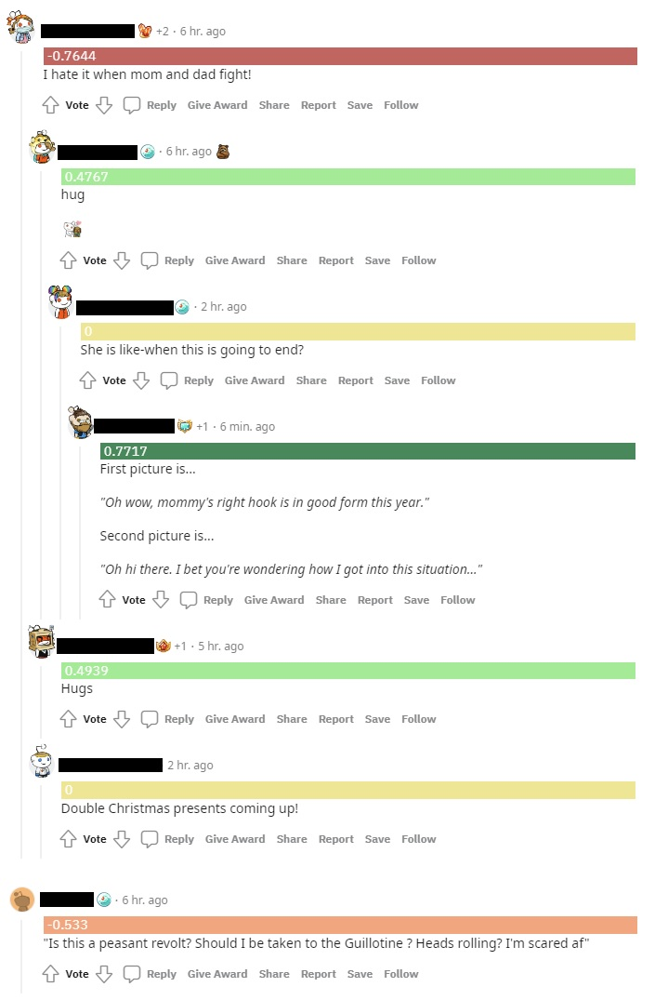
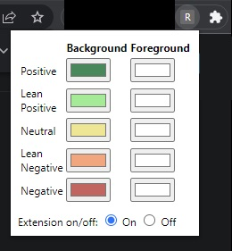

# Reddit Sentiment Analyzer

Reddit Sentiment Analyzer is a Chrome extension that augments Reddit viewing experience by
scoring each Reddit comment's sentiment polarity (positive/negative)
using [VADER](https://github.com/cjhutto/vaderSentiment),
a lexicon and rule-bases sentiment analysis tool.

The score ranges from -1.0 to 1.0 and would appear in a banner above each comment.
The banner would have different background and foreground colors depending on the score.
There are 5 different sets of colors for the following 5 sentiments.

| Sentiment     | Score        |
| ------------- | ------------ |
| Positive      | \[0.6,1.0\]  |
| Lean Positive | \[0.2,0.6)   |
| Neutral       | \[-0.2,0.2)  |
| Lean Negative | \[-0.6,-0.2) |
| Negative      | \[-1.0,-0.6) |

All the colors are customizable.
There is also an on/off toggle that controls whether the extension is enabled.

## Install and Run

To install the extension in Chrome, you can:
- Clone the Git repo to your desired location.
- Navigate to `chrome://extensions/` in Chrome.
- Turn on "Developer mode" (controlled by the toggle on the upper right).
- Click "Load unpacked" and load the `extension` folder in the cloned Git repo.
- You should now see Reddit Sentiment Analyzer in your extension tray.
  You can pin it if you want.

Once you have the extension installed, you can go to Reddit
where you should see the sentiment scores in the Reddit comment pages.
You can configure the colors and toggle the extension on and off in the extension popup.

## Implementatioin Details

### VADER and Browserify

The extension uses a JavaScript port of VADER, [vaderSentiment-js](https://github.com/vaderSentiment/vaderSentiment-js),
to score the Reddit comments.
To use the npm package inside a browser extension, [Browserify](https://browserify.org/)
is employed to bundle the package inside a JavaScript file: [`bunlde.js`](./extension/bundle.js),
which can be loaded into the web pages when needed.

The steps to generate the [`bunlde.js`](./extension/bundle.js) are as follows:
- Download and install node.js and npm. (Instructions can be found [here](https://docs.npmjs.com/downloading-and-installing-node-js-and-npm).)
- Install Browserify: `npm install -g browserify`.
- Inside the [`nodejs`](./nodejs) folder, run `make`,
  which should invoke the instructions in the [`Makefile`](./nodejs/Makefile) to "browserify" vaderSentiment-js.
  (If you are on a platform that does not support make, just run the command in the [`Makefile`](./nodejs/Makefile).)

### The Extension

Implementation of the extension itself can be found in the [`extension`](./extension) folder,
which can be loaded as an unpacked extension in Chrome once you have "Developer mode" enabled.

The [`manifest.json`](./extension/manifest.json) is the Chrome extension manifest file.
It ties the files in the unpacked extension together and tells Chrome what each file does.

The [`popup.html`](./extension/popup.html) and [`popup.js`](./extension/popup.js) are for the extension popup.
When you have the extension installed and click its icon in your Chrome extension tray,
you will see the popup where you can configure the background and the foreground colors for each of the 5 sentiments
and toggle the extension on and off.
The configurations (the extension state) are persisted using [`chrome.storage`](https://developer.chrome.com/docs/extensions/reference/storage/).

The [`bundle.js`](./extension/bundle.js) and [`content.js`](./extension/content.js) are loaded into each
page that matches the url filter defined in the manifest.
The bundle packages the JavaScript port of VADER which is used in the content script to score the comments.
The content script finds the comments inside a Reddit page using query selectors,
scores them, and displays them as configured.

The [`background.js`](./extension/background.js) initializes the extension on install and listens
for tab updates so that it sends a message to the content script if the tab updated is a Reddit comment page.
The content script only starts looking for comments and score them when messaged by the background script.
When the extension is toggled off, the background script will stop sending messages to the content script.

## Note

This is a solo team.